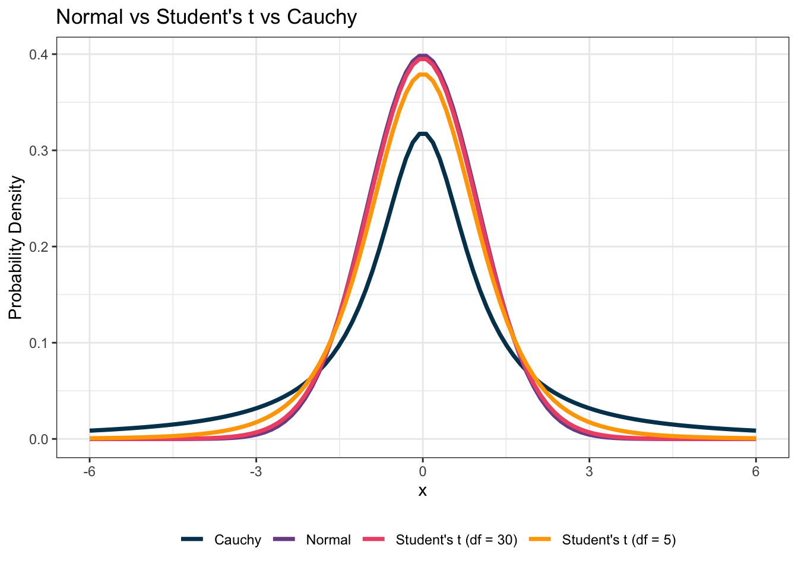
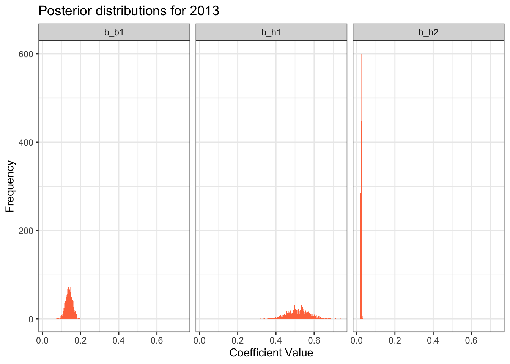
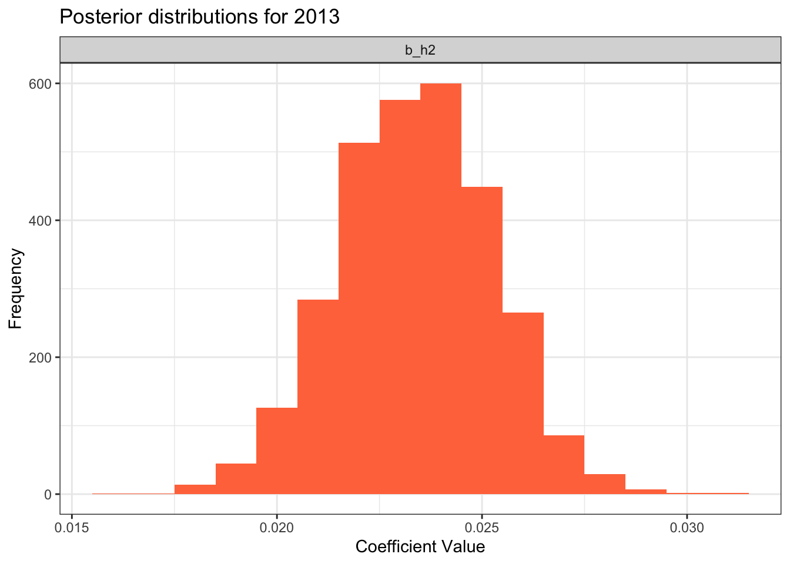
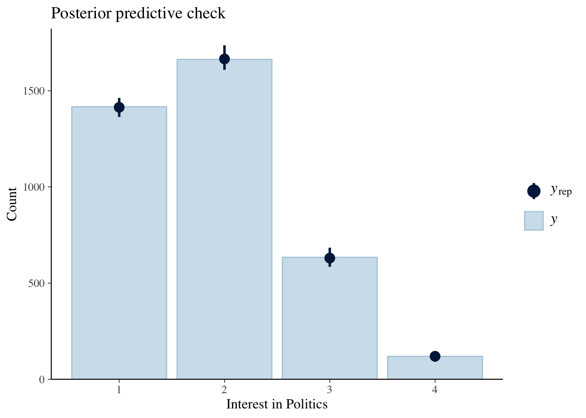
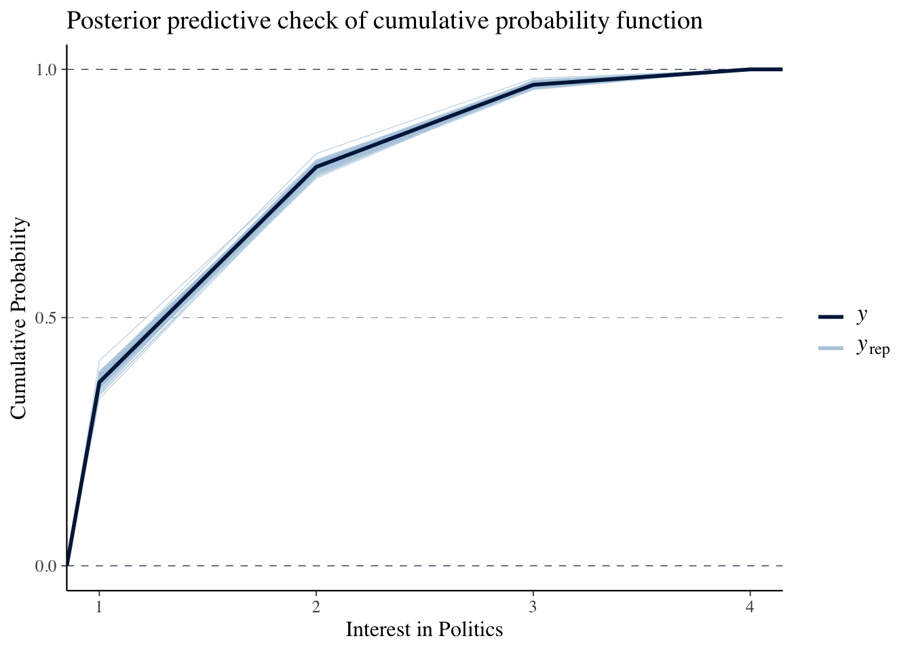
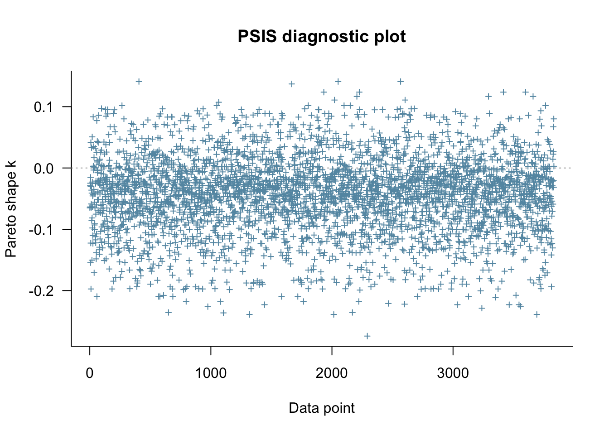
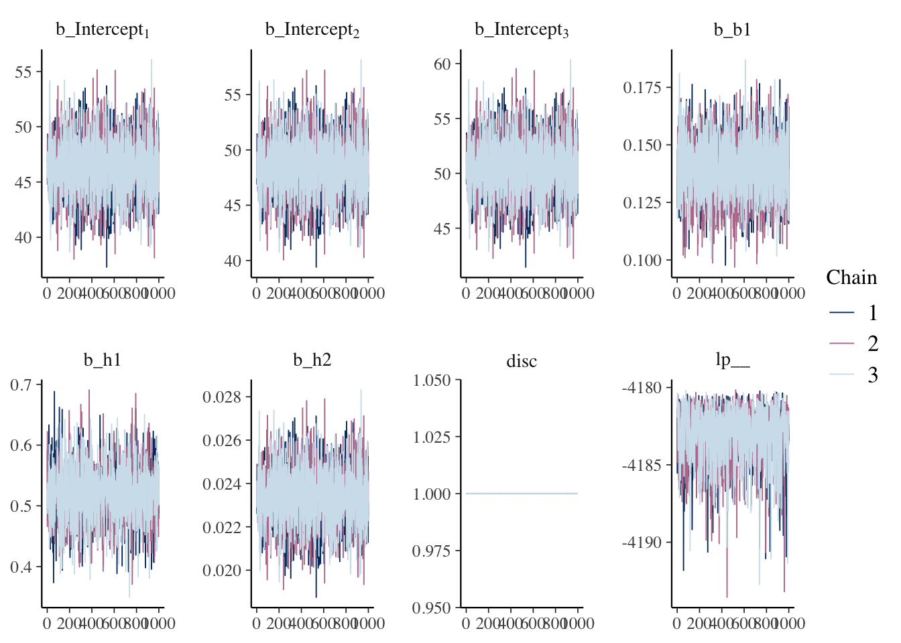
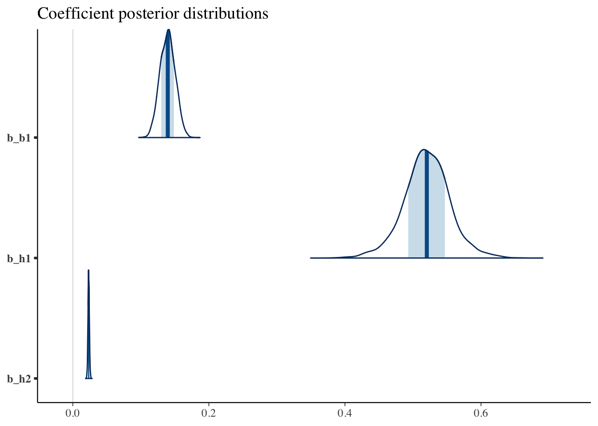
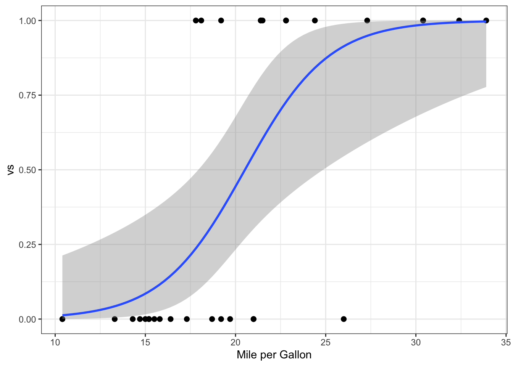
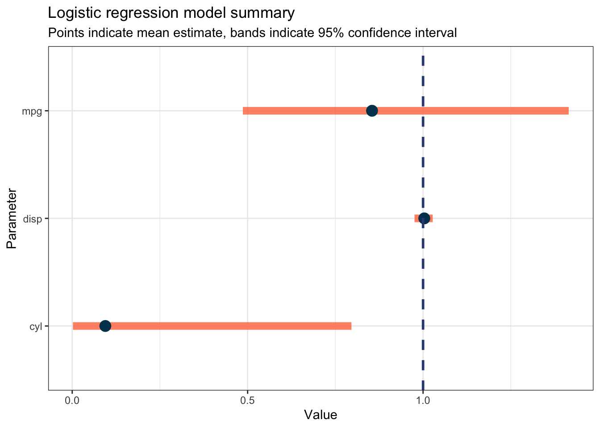

# A structured Bayesian workflow for program evaluation and management consulting


With a basic understanding of Bayesian statistics, its general workflow, and other statistical models and distributions, we can now take a look at the proposed structured workflow for Bayesian analysis on program evaluation and consulting projects. There are five key components to the process and each will be explored in turn below.

1. Use qualitative project components to develop priors
2. Specify appropriately uncertain priors for your context, despite purported stakeholder certainty
3. Think generatively about the underlying statistical process of interest
4. Test competing models using LOO-CV and K-Fold-CV
5. Emphasise credible intervals over point estimates in outputs and graphics

## 1. Use qualitative project components to develop priors

Every consulting and program evaluation project I have worked on or heard of has involved some amount of stakeholder engagement. Whether it is something as minor as a project kickoff meeting, or more extensive consultation through interviews and workshops, there is always an aspect of talking to stakeholders. However, the typical way this process is used in consulting is to "supplement" quantitative analysis with the findings from qualitative engagement, or to "contextualise" quantitative outputs. This means the quantitative and qualitative are often discretised and only ever thought about in conjunction when it comes time to produce a deliverable or synthesise the entire project into a set of core findings. What can we do to make this relationship between quantitative and qualitative better and more informative? We can build in our understanding of the likely relationships (obtained through stakeholder engagement or other reading) into our statistical models as *priors*. Note that this is only possible within the Bayesian framework, not the traditional frequentist lens.

### How to elicit priors from interviews of qualitative reading

Th thought of trying to make a quantitative prior probability distribution from information that may not even remotely involve a number can be daunting. However, it primarily rests on the analyst's ability reason and think abstractly about the information they are hearing or reading. As an example, let's say a stakeholder said the following statement to your project team in an interview:

**Stakeholder Statement 1: We have many different service providers who deliver the program. We believe, anecdotally, that quite a few perform much better than the others, while quite a few perform much worse.**

There is not a single number contained in the statement. But does that mean we cannot use the information in a statistical model? Certainly not. There are some key parts of the statement that we can extract and examine further:

* *Quite a few perform much better than the others, while quite a few perform much worse*
* *We have many different service providers who deliver the program*

#### Quote 1: Quite a few perform much better than the others, while quite a few perform much worse

Let's take a look at the first quote. If we think distributionally, this information is very useful. It suggests that when we are thinking about effects, most are somewhere in the middle, but there are a decent amount toward the extremes. In a regression context, which is most often the case in consulting/program evaluation, these effects usually relate to regression coefficients (the value that relates a change in predictor value with change in output value). The initial reaction might be to use a normal distribution to specify a prior for the coefficient. This might be sufficient in a lot of cases, but if we really pay attention to the quote, it suggests the *tails* of the coefficient distribution are likely "fatter" (i.e. multiple providers) at each end. This is not really congruent with the idea of the normal distribution. What can we use instead?

We could use two distributions that a very similar to the normal, but which have fatter tails. These are the [Student's t distribution](https://en.wikipedia.org/wiki/Student%27s_t-distribution) and the [Cauchy distribution](https://en.wikipedia.org/wiki/Cauchy_distribution). We can graph their probability densities against the normal to demonstrate this shift in the tail probabilities visually:


```r
# Simulate some random datapoints and calculate probability densities for each distribution type

tmp <- data.frame(x = seq(-6, 6, length.out = 100)) %>%
  mutate(normal = dnorm(x, mean = 0, sd = 1),
         student_5 = dt(x, df = 5),
         student_30 = dt(x, df = 30),
         cauchy = dcauchy(x, location = 0, scale = 1)) %>%
  gather(key = dist_type, value = y, 2:5) %>%
  mutate(dist_type = case_when(
    dist_type == "normal"     ~ "Normal",
    dist_type == "student_5"  ~ "Student's t (df = 5)",
    dist_type == "student_30" ~ "Student's t (df = 30)",
    dist_type == "cauchy"     ~ "Cauchy"))

# Plot it

tmp %>%
  ggplot(aes(x = x, y = y, colour = dist_type)) +
  geom_line(size = 1.25) +
  labs(title = "Normal vs Student's t vs Cauchy",
       x = "x",
       y = "Probability Density",
       colour = NULL) +
  theme_bw() +
  scale_colour_manual(values = c("#003f5c", "#7a5195", "#ef5675", "#ffa600")) +
theme(legend.position = "bottom")
```



Evidently, either one of these new distributions might capture the subject matter expert's information better than defaulting to a normal. We can see this as the tails of all the specified distributions sit "above" that of the normal's - indicating higher probability density in the tails (i.e. the collection of extreme providers). In my code you can see I played around with the [degrees of freedom](https://en.wikipedia.org/wiki/Degrees_of_freedom_(statistics)) parameter of the Student's t distributions, but did not adjust any of the others too much. As the degrees of freedom approaches the sample size, the Student's t distribution will approximate the normal distribution. I adjusted the `df` parameter mostly for visual illustration, but the process of choosing appropriate prior distribution parameters is a very important one. Let's take a closer look.

As we know, priors tend to be dominated by the likelihood when the sample size is large. We also know that this occurs especially when priors are vague (i.e. wide and "uninformative"). So if we set a normal prior with a wide standard deviation, it is likely that this will be dominated by the likelihood as it is not contributing much *specific* value compared to the (more likely) tighter likelihood distribution.

**Prior Specification Key Takeaway: If you have a lot of uncertainty or want the actual data/likelihood to drive the posterior, specify a wide prior**

As a useful one-stop-shop resource for choosing a distribution, the table below denotes a few high-level descriptions of values we may encounter in the real world and the probability distributions that might appropriately model it. This list is not exhaustive and should only serve as a starting point or primer to dig deeper. Further, there is no indication of appropriate distribution parameters as this is case-dependent.


Table: (\#tab:unnamed-chunk-3)Known value types and corresponding potential distributions

|Types of values              |Bernoulli |Beta |Cauchy |Gamma |Normal |Ordered logistic |Poisson |Negative binomial |Student's t |
|:----------------------------|:---------|:----|:------|:-----|:------|:----------------|:-------|:-----------------|:-----------|
|Positive only                |No        |No   |No     |Yes   |No     |No               |No      |No                |No          |
|Non-negative integer         |No        |No   |No     |No    |No     |No               |Yes     |Yes               |No          |
|Numeric between 0 and 1      |No        |Yes  |No     |No    |No     |No               |No      |No                |No          |
|Numeric negative or positive |No        |No   |Yes    |No    |Yes    |No               |No      |No                |Yes         |
|Binary categorical           |Yes       |No   |No     |No    |No     |No               |No      |No                |No          |
|Ordered categorical          |No        |No   |No     |No    |No     |Yes              |No      |No                |No          |

Now let's take a look at the second quote.

#### Quote 2: We have many different service providers who deliver the program

X

## 2. Specify appropriately uncertain priors for your context, despite purported stakeholder certainty

In my consulting experience, I have encountered stakeholders who maintain a sense of certainty and are adamant about outcomes being X or something must be Y. While the above example showed that it is possible to elicit useful information for statistical models from consultations, it is important to temper this with an understanding that there is very likely quite a bit of error or uncertainty around these statements. It may be tempting to take stakeholder information and construct a very narrow prior, and in some cases this is appropriate, but in consulting and policy/program work, it is more often than not a very messy and complex landscape where quantification of uncertainty is much needed and very important. This means analysts need to be able to listen to, understand, and value stakeholder information, but also consider it alongside the statistical implications.

## 3. Think generatively about the underlying statistical process of interest

We covered much of the detail in this component in an earlier chapter, but will discuss it briefly again here. The basic premise is to think in-depth about the statistical process that might generate the data you will see. This will govern the selection of probability density/probability mass function used which has major implications for the analysis. A sample line of questioning that an analyst may consider at this stage is presented below (we are going to assume the outcome is continuous for the example):

* Is my outcome categorical, ordinal or continuous?
* Does any evidence exist about the population distribution or distributions of other samples?
* Is my outcome likely to be roughly normally distributed in the population? Why/why not?
* Is there likely to be more edge/extreme cases than one would expect in a normal distribution?

## 4. Test competing models using LOO-CV and K-Fold-CV

[Cross-validation (CV)](https://en.wikipedia.org/wiki/Cross-validation_(statistics)) is a powerful out-of-sample-based tool for model selection and evaluation of model performance ([Vehtari, Gelman, & Gabry, 2016](https://link.springer.com/article/10.1007/s11222-016-9696-4)). At a high level, it essentially works by removing a select number of samples X many times and . See [this article](https://avehtari.github.io/modelselection/roaches.html) by Vehtari (2017) for a great explanation and applied example of Bayesian model selection using cross-validation techniques. There are two main CV techniques used for evaluating Bayesian models:

1. Leave-one-out cross-validation
2. K-Fold cross-validation

### Leave-one-out cross-validation

Leave-one-out cross-validation (LOO-CV or just 'LOO') is the most common form of CV for Bayesian analysis. It essentially works by removing a single datapoint as the *test* validation set, and using the remaining datapoints as the *train* set. We can compare models using the `loo` package in `R` easily with the function `loo_compare()` (where `loo1`, `loo2` etc are loo objects):


```r
library(loo)
loo_compare(loo1,loo2)
```

### K-Fold cross-validation

K-Fold cross validation (K-Fold) is a technique commonly employed by Bayesian analysts when models are more complex and include random effects, typically at the individual level. Traditional LOO is inappropriate for these models, because the random effects term is highly sensitive to the removal of any observations. K-Fold gets around this problem by diving up the data into *K* number of subsets, and then refitting the model *K* times, each time leaving out a single subset. Luckily for us, the fantastic `loo` package in `R` allows for comparison of models evaluated using LOO and K-Fold using the same `loo_compare()` function seen in the LOO section above.

## 5. Emphasise credible intervals over point estimates in outputs and graphics

The final component in the structured Bayesian workflow is the presentation of findings. This is the most important part of the process for convincing others (especially non-technical people) that your workflow is appropriate and more informative than the comparatively quicker and easier frequentist modelling equivalent. Further, good data visualisation and presentation of findings (i.e. tables and descriptions) are key to **not** misleading readers into a false sense of certainty - one that permeates typical consulting reports where *p* values are seen as the most important thing and values such as [standard errors](https://en.wikipedia.org/wiki/Standard_error) and [confidence intervals](https://en.wikipedia.org/wiki/Confidence_interval) are typically omitted. The single most useful thing an analyst can do after modelling is complete, is present appropriate uncertainty bounds around any statistical outputs. Within the Bayesian framework, these are known as [credible intervals](https://en.wikipedia.org/wiki/Credible_interval).

### Credible intervals versus confidence intervals

Credible intervals specify the range in which a parameter values lies with a specified probability (compared to confidence intervals which are *not* probability distributions). Instead, confidence intervals are based off the frequentist long-run frequency concept. This denotes that if the data were collected many more time (e.g. 100), the parameter value would lie in a given range 95 out of those 100 times (without much care to *how* far outside the range it was in the other 5). Remember that in Bayesian statistics we treat parameters as random (and data as fixed) values to be estimated, while frequentists assume parameters are fixed values (and data is random) and can be better understood by collecting more data. Much like confidence intervals, the choice of interval is rather arbitrary, but it is common to see combinations of `80%`, `90%`, and `95%` in Bayesian analysis.

Let's fit some Bayesian (and frequentist) models and graph them in a few different styles so you can get a sense of what these visualisations might look like. Note that producing these graphics in standard consulting tools such as Microsoft Excel or Think-cell is non-trivial if not impossible (as well as not being reproducible).

### Uncertainty Visualisation Example 1: Bayesian posterior distributions

The intuition behind uncertainty visualisation is the most important part of this section, but please have a read through the data wrangling and modelling code to try and understand what I have done. This first chunk of code is simply loading in and preparing the data for modelling. We are going to be looking at the [Australian Election Voter Study](https://australianelectionstudy.org/voter-studies/) and using 2013 data to derive informative priors for analysis on 2016 data. This is an example of a project that is perfect for a Bayesian approach and one that many consulting firms might undertake, as many firms release annual reports/updates on key sectors they service. A lot of tutorials and texts would opt for a synthetic or simple example here, but I want to highlight in this example that in consulting/program evaluation, when it's done well, so much work is performed on just the preprocessing before any analysis is conducted. I won't explain too much of the specifics here as data wrangling is not the focus of this book, but please run each segment and explore what I have done if you are not familiar with any of what I have written.


```r
# Read in datafiles and reduce dataset size to columns of interest

d_2013 <- read_sav("data/2. Australian Election Study, 2013.sav") %>%
  dplyr::select(c(b1, a1, h1, h2)) %>%
  drop_na()

d_2016 <- read_sas("data/2. Australian Election Study, 2016.sas7bdat") %>%
  dplyr::select(c(B1, A1, H1, H2)) %>%
  drop_na() %>%
  clean_names()

# Function to recode parties so they are interpretable, and clean up other variables

cleaner <- function(data, year) {
  
  # Recode parties
  
  tmp <- data %>%
    mutate(b1 = as.numeric(b1)) %>% 
    filter(b1 != 999) %>%
    filter(a1 != 999) %>%
    filter(h1 != 999) %>%
    filter(h2 != 999) %>%
    filter(b1 != -1) %>%
    mutate(b1_name = case_when(
           b1 == "1" ~ "Liberal",
           b1 == "2" ~ "Labor",
           b1 == "3" ~ "National (Country) Party",
           b1 == "4" ~ "Greens",
           b1 == "5" ~ "Other party",
           b1 == "6" ~ "No party"))
  
  # Calculate age and make response variable an ordered factor
  
  tmp1 <- tmp %>%
    mutate(age = year - h2) %>%
    mutate(age >= 18) %>%
    mutate(a1 = factor(a1, levels = c(1,2,3,4), ordered = TRUE))
  
  return(tmp1)
}

prep_2013 <- cleaner(d_2013, 2013)
prep_2016 <- cleaner(d_2016, 2016)

# Build 2013 model with vague and uninformative priors

m1 <- brm(a1 ~ b1 + h1 + h2,
          data = prep_2013, family = cumulative("logit"),
          iter = 2000, chains = 3, seed = 123)

# Visualise distribution of coefficient posteriors to get correct prior shape for 2016

as.data.frame(m1) %>%
  clean_names() %>%
  dplyr::select(c(b_b1, b_h1, b_h2)) %>%
  gather(key = parameter, value = value, 1:3) %>%
  ggplot(aes(x = value)) +
  geom_histogram(binwidth = 0.001, fill = "#ff764a") +
  labs(title = "Posterior distributions for 2013",
       x = "Coefficient Value",
       y = "Frequency") +
  theme_bw() +
  facet_wrap(~parameter)
```



The distribution for the coefficient of `b1` (party) seems approximately normal so we will use that for the 2016 model. The distribution for the coefficient of `h1` (sex) has fatter tails than a normal distribution, so we will specify a Cauchy for this variable. The distribution for the coefficient of `h2` (age) is a bit hard to determine visually with the scale of the other variables squishing it. Let's plot it by itself to see. It's mildly [kurtotic](https://en.wikipedia.org/wiki/Kurtosis), but largely it appears we have another normally-distributed coefficient posterior.


```r
as.data.frame(m1) %>%
  clean_names() %>%
  dplyr::select(c(b_b1, b_h1, b_h2)) %>%
  gather(key = parameter, value = value, 1:3) %>%
  filter(parameter == "b_h2") %>%
  ggplot(aes(x = value)) +
  geom_histogram(binwidth = 0.001, fill = "#ff764a") +
  labs(title = "Posterior distributions for 2013",
       x = "Coefficient Value",
       y = "Frequency") +
  theme_bw() +
  facet_wrap(~parameter)
```



We can now dynamically extract the mean and standard deviation of each coefficient and build these into the 2016 model directly.


```r
# Extract model components to use as prior for 2016

priors <- as.data.frame(m1) %>%
  clean_names() %>%
  summarise(beta_party_mean = mean(b_b1),
            beta_party_sd = sd(b_b1),
            beta_sex_mean = mean(b_h1),
            beta_sex_sd = sd(b_h1),
            beta_age_mean = mean(b_h2),
            beta_age_sd = sd(b_h2))

# Insert extracted values into priors for 2016 use

party_prior <- paste0("normal(",priors$beta_party_mean,",",priors$beta_party_sd,")")
sex_prior <- paste0("cauchy(",priors$beta_sex_mean,",",priors$beta_sex_sd,")")
age_prior <- paste0("normal(",priors$beta_age_mean,",",priors$beta_age_sd,")")

# Fit 2016 model

m2 <- brm(a1 ~ b1 + h1 + h2,
          data = prep_2013, family = cumulative("logit"),
          prior = c(set_prior(prior = party_prior, class = "b", coef = "b1"),
                    set_prior(prior = sex_prior, class = "b", coef = "h1"),
                    set_prior(prior = age_prior, class = "b", coef = "h2")),
          iter = 2000, chains = 3, seed = 123)
```

Now that our model has run, we can evaluate how well it fit through a few key visualisations using the excellent [`bayesplot`](https://mc-stan.org/bayesplot/#:~:text=bayesplot%20is%20an%20R%20package,functions%20from%20the%20ggplot2%20package.) package.

#### Model Fit 1: Posterior predictive checks

Posterior predictive checks (PPC) are a very useful tool for visually model fit and the model's capacity to simulate the observed data. For an ordinal model, we can produce barplots rather than continuous distributions. Ideally, we want our simulated data `yrep` (dark blue point and bars) to be overlapping with the top of the real sample `y` bars.


```r
pp_check(m2, type = "bars", nsamples = 100) +
  labs(title = "Posterior predictive check",
       x = "Interest in Politics",
       y = "Count")
```



We can also check the cumulative probability function. Ideally, for each level of interest in politics, we want our simulated data to track around but close to the real sample.


```r
pp_check(m2, type = "ecdf_overlay", nsamples = 100) +
  labs(title = "Posterior predictive check of cumulative probability function",
       x = "Interest in Politics",
       y = "Cumulative Probability")
```



#### Model Fit 2: LOO-CV

We can visually inspect our model's sensitivity using a LOO plot. We want no values to exceed 0.5 and definitely none to exceed 0.7.


```r
loo1 <- loo(m2)
plot(loo1)
```



#### Model Fit 3: Traceplots

At a high level, we can check if the multiple chains mixed in one line of `R` code. We want these just to look like white noise, which they do here.


```r
color_scheme_set("mix-blue-pink")
mcmc_trace(m2, facet_args = list(nrow = 2, labeller = label_parsed))
```



#### Final posterior visualisation

With model checks done, and since this section is about posterior distribution visualisation, here is how you can automate in a few-liner rather than manually building histograms like we did earlier.


```r
mcmc_areas(m2, regex_pars = c("b1", "h1", "h2"), area_method = "scaled height") +
  labs(title = "Coefficient posterior distributions")
```



### Uncertainty Visualisation Example 2: Frequentist logistic regression

Uncertainty visualisation is not limited to Bayesian statistics. Many `R` programmers are likely familiar with the `geom_smooth()` function that enables automated plotting of regression models and their confidence intervals. We can produce a quick univariate graph to illustrate this very easily using the classic `mtcars` dataset:


```r
mtcars %>%
  ggplot(aes(x = mpg, y = vs)) +
  geom_point(size = 2) +
  geom_smooth(formula = y ~ x, method = "glm", method.args = list(family = "binomial"), se = TRUE) +
  theme_bw() +
  labs(x = "Mile per Gallon",
       y = "vs")
```



This graph appropriately denotes the relative uncertainty associated with the change in miles per gallon and the corresponding change in vs. However, while a univariate case makes for an easy graph, a multivariate case is much more realistic, where the end graphic is likely a plot of the regression coefficients and corresponding confidence intervals.


```r
# Fit model

m3 <- glm(vs ~ mpg + cyl + disp, family = "binomial",
          data = mtcars)

# Extract coefficients and confidence intervals

coefs <- as.data.frame(coef(m3))

coefs <- rownames_to_column(coefs, "parameter")

confs <- as.data.frame(confint(m3)) %>%
  rename(lower = "2.5 %") %>%
  rename(upper = "97.5 %")

confs <- rownames_to_column(confs, "parameter")

outs <- coefs %>%
  left_join(confs, by = c("parameter" = "parameter"))

# Exponentiate to convert log-odds to odds for easier interpretation

odds <- outs %>%
  rename(coefficient = `coef(m3)`) %>%
  mutate(coefficient = exp(coefficient),
         lower = exp(lower),
         upper = exp(upper)) %>%
  filter(parameter != "(Intercept)")

# Plot it

odds %>%
  ggplot() +
  geom_segment(aes(x = lower, xend = upper, y = parameter, yend = parameter), size = 3, colour = "#ff764a", alpha = 0.8) +
  geom_point(aes(x = coefficient, y = reorder(parameter, coefficient)), size = 4, colour = "#003f5c") +
  geom_vline(xintercept = 1, lty = "dashed", size = 1, colour = "#374c80") +
  labs(title = "Logistic regression model summary",
       subtitle = "Points indicate mean estimate, bands indicate 95% confidence interval",
       x = "Value",
       y = "Parameter") + 
  theme_bw()
```



### Other useful uncertainty visualisation resources

Many other great statisticians and researchers have produced guides and software packages for uncertainty visualisation. A few of these resources are listed below:

* [`tidybayes`](http://mjskay.github.io/tidybayes/) - `R` package for Bayesian analysis using the [grammar of graphics](https://vita.had.co.nz/papers/layered-grammar.html) approach
* [Visualizing uncertainty](https://clauswilke.com/dataviz/visualizing-uncertainty.html) - chapter from 'Fundamentals of Data Visualisation' by Claus O. Wilke
* [Uncertain About Uncertainty: How Qualitative Expressions of Forecaster Confidence Impact Decision-Making With Uncertainty Visualizations](https://www.frontiersin.org/articles/10.3389/fpsyg.2020.579267/full) - paper by Padilla, Powell, Kay, and Hullman (2021)

And remember: it's almost always a bad idea to turn off confidence/credible interval shading on regression plots (yes, the frequentist equivalents too).
